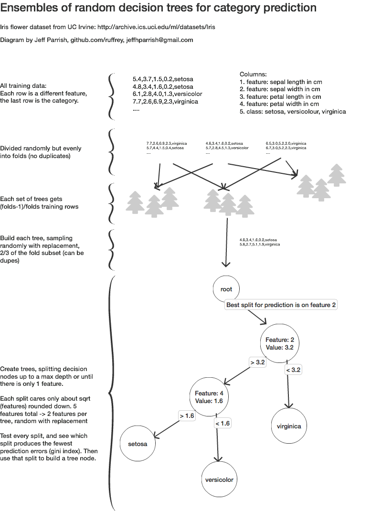

# Pine - a tool for Random Decision Forests

Ensembles of random decision trees.

This app implements the machine learning technique of generating groups of random decision trees, where each is responsible for small parts of the dataset.

See [this Kaggle discussion](https://www.kaggle.com/general/3920) of the term *random forest*.

## usage

The `tree` executable can be [downloaded on the Releases page](https://github.com/ruffrey/pine/releases).

[Go](https://golang.org/dl) is required to build this app yourself:
```bash
cd pine/tree
make deps
go build # outputs the executable "tree" app
./tree # prints help
```

Training:
```bash
./tree -train -data=../test-data/iris.csv -save=../sav.gob
```

Predicting:
```bash
./tree -pred -model=../sav.gob -seed=5.7,3.8,1.7,0.3
```

All options:

```text
Usage of ./tree:
  -charmode skipSize
    	Character prediction mode rather than numeric feature mode. This will create test cases by iterating through the data skipSize at a time, and making the previous `sequenceLength` items have higher weights based on the closeness to the current item being predicted.s
  -data string
    	Training data input file
  -folds int
    	How many subdivisions of the dataset to make for cross-validation (default 5)
  -m int
    	Override calculation for feature split size (little m)
  -max int
    	Stop predicting after this many rounds (-pred only)
  -model string
    	Load a pretrained model for prediction
  -pred
    	Make a prediction
  -profile string
    	[cpu|mem] enable profiling
  -save string
    	Where to save the model after training
  -seed string
    	Predict based on this string of data
  -seqlen int
    	Normally equal to the number of variables during -charmode, override for fewer previous look-behind-memory-variables in every input test cases
  -skipsize int
    	During -charmode, how many items to skip before making another training case (default 3)
  -subsetpct float
    	Percent of the dataset which should be used to train a tree (always minus 1 fold for cross-validation) (default 0.6)
  -tojson
    	Convert a model to json
  -train
    	Train a model
  -trees int
    	How many decision trees to make per fold of the dataset (default 1)
```

## experimental character mode

There is an experimental `-charmode` flag that attempts to encode strings of text and make predictions on it, like you would with a neural network.

## how it works



Given a data set, rows of input features x, where the last column is the expected category y.
Often these are encoded in CSV format. The data should be encoded to float32 parseable values.

Train a set of random decison trees per bag:
- Given a training set (group of every bag/folds except one, see cross validation below) and a test training set
- Do the following to create however many trees you want in each set:
    - randomly select a sample that is 2/3 of the training set with replacement. There are likely duplicate values.
    - With the sample, determine the best split point of the data:
        - `M` is the total number of input features.
        - `m` is a subset of features from the total number of features that each tree will be responsible for caring about. In other words, each tree will try to best predict only `m` out of `M` total features. Ways to calculate `m` are like the square root of `M` or other ways to produce a smaller value.
        - So, randomly pick `m` features for this tree to care about.
        - For each feature, run through every possible split of the features of the input rows.
        - Track which predictions are correct and which are not. Use the split that has the most correct predictions on this data sample. This is also called minimizing the Gini error.  
    - Continue splitting the tree into nodes until reaching the maximum desired depth, or until naturally reaching the end of the tree.

Once you have a trained tree, a prediction is made by running a sample without the last column through every tree, and getting the mode (most frequent) prediction across the trees.

### Cross-validation

Cross-validation is a way minimize the out-of-bag error. In other words, we validate that samples *not* in the bags are still predicted correctly.
 
To do it, start by splitting the whole dataset into equal bags (or folds) without replacement, before creating the bags.

For example, say there are 20 samples and we want 4 folds. Each fold will have 5 samples, and none of the 20 samples will be repeated across all the folds. However, they need to be put randomly into the folds (random without replacement).

Next, loop through all the folds. The fold in the loop iteration will be the test set, so reserve it for later. Use all the other folds to train a set of decision trees. In our example above, that means on the first fold, we would use the last 3 for training, on the second, use the first fold and the last two for training, etc. For every training set, construct decision trees that best predicts it.

# License

MIT

# Sources

http://blog.citizennet.com/blog/2012/11/10/random-forests-ensembles-and-performance-metrics

http://blog.yhat.com/posts/random-forests-in-python.html

https://machinelearningmastery.com/implement-random-forest-scratch-python/
